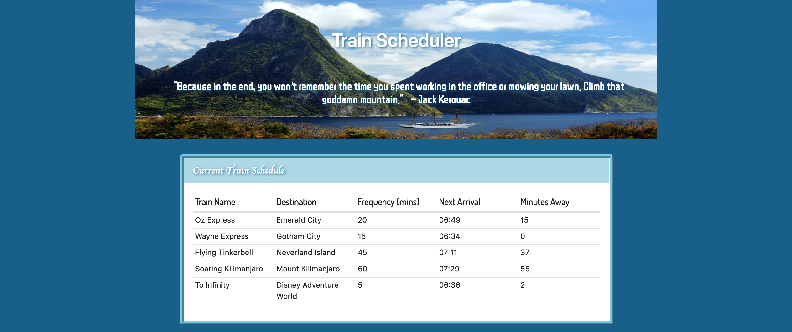
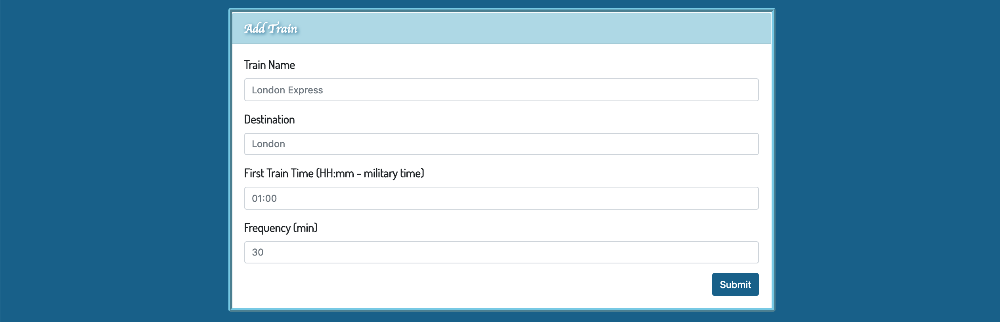

# Train Scheduler :train2:

### Welcome to my Train Scheduler page! 

#### At the start of my webpage, you will see the following screen which shows the current train schedule:

#### At the second half of the page, there is a submission box where the user may submit information for a new train to be added to the schedule. 

## Deployed Site
Use this link to see the deployed site: https://jerpowel321.github.io/Train-Scheduler/

## Built With
- HTML
- CSS
- JavaScript
- JQuery
- Firebase
- Moment.JS

## Authors
Jennifer Powell 